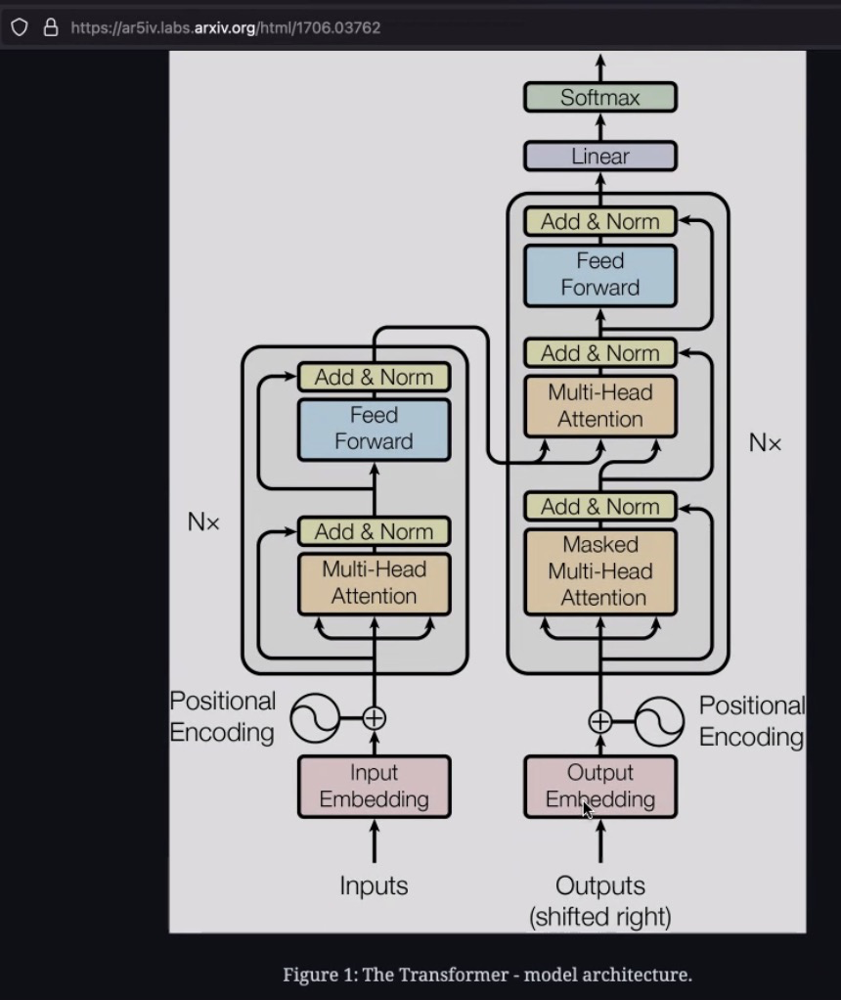
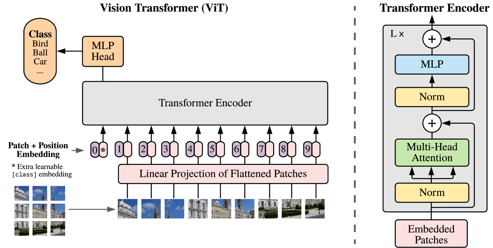

<!-- _paginate: false -->
<!-- _backgroundColor: #f4f6fa -->
<!-- _color: #0d47a1 -->

# <!-- fit --> Day 3 — Transformers for Vision

From attention to ViT, and how it compares to CNNs

---

# The Transformer block

The original Transformer (Vaswani et al., 2017):

- **Multi-head self-attention** — every token attends to every other token
- **Feed-forward MLP** applied per token
- **Residual + LayerNorm** around each sub-block
- Stacks of these blocks, no recurrence, no convolution

<!--
Originally for machine translation — sequence in, sequence out.
The key idea: attention replaces both recurrence (RNNs) and locality (CNNs).
-->

---

# Self-attention in one line

For each token, compute a weighted sum of *all* tokens:

$$
\text{Attention}(Q, K, V) = \text{softmax}\!\left(\frac{QK^\top}{\sqrt{d_k}}\right) V
$$

- $Q, K, V$ are linear projections of the input
- $QK^\top$ is the similarity matrix (who looks at whom)
- The softmax row gives attention weights summing to 1
- Multi-head = run this in parallel with different projections, then concatenate

---

# From text tokens to image patches

Transformers eat sequences of tokens. An image is a 2D grid of pixels. **How do we bridge?**

→ Cut the image into fixed-size patches (e.g. 16×16), flatten each patch into a vector, and treat each patch like a "word".

A 224×224 image with 16×16 patches → 14×14 = **196 tokens**.

That's it — the rest of the architecture is essentially the same Transformer encoder.

---

# Vision Transformer (ViT)

Dosovitskiy et al., 2020 — *"An image is worth 16×16 words"*

1. Split image into patches
2. **Linear projection** of each patch → patch embedding
3. Prepend a learned `[CLS]` token
4. Add **positional embeddings** (the model has no spatial prior!)
5. Pass through $N$ Transformer encoder blocks
6. The `[CLS]` token's final embedding → MLP head → class

---

# What's different from a CNN?

| Aspect          | CNN                          | ViT                                    |
| --------------- | ---------------------------- | -------------------------------------- |
| Inductive bias  | Locality, translation equiv. | Almost none                            |
| Receptive field | Grows with depth             | **Global from layer 1**                |
| Parameters      | Shared filters               | Dense attention + MLPs                 |
| Data hunger     | Works on small datasets      | Needs lots of data (or pretraining)    |
| Compute         | FLOPs ∝ spatial size         | FLOPs ∝ (num patches)² for attention   |

---

# When does each win?

**CNNs win when:**

- Data is limited (< ~1M images)
- Strong locality matters (textures, fine-grained edges)
- You need cheap inference at high resolution

**ViTs win when:**

- You have a lot of data — or a good pretrained model
- The task benefits from long-range dependencies
- You're fine-tuning from a foundation model (DINOv2, CLIP, SAM …)

Hybrid models (Swin, ConvNeXt) borrow ideas from both.

---

# What you'll build today

Notebook `09_building_vit.ipynb` — a ViT from scratch:

1. **Patch embedding** with `nn.Conv2d(kernel_size=patch, stride=patch)`
2. **Learnable `[CLS]` token** + **positional embedding**
3. A single **Transformer encoder block** (multi-head attention + MLP + residuals)
4. Stack $N$ blocks, classification head
5. Train on CIFAR-10 — confirm it learns, even if accuracy lags a CNN at this scale

Then `10_cnn_vs_vit.ipynb` — side-by-side comparison.

---

<!-- _backgroundColor: #f4f6fa -->
<!-- _color: #0d47a1 -->
<!-- _paginate: false -->

# <!-- fit --> Let's build a ViT.

Open `notebooks/09_building_vit.ipynb`
